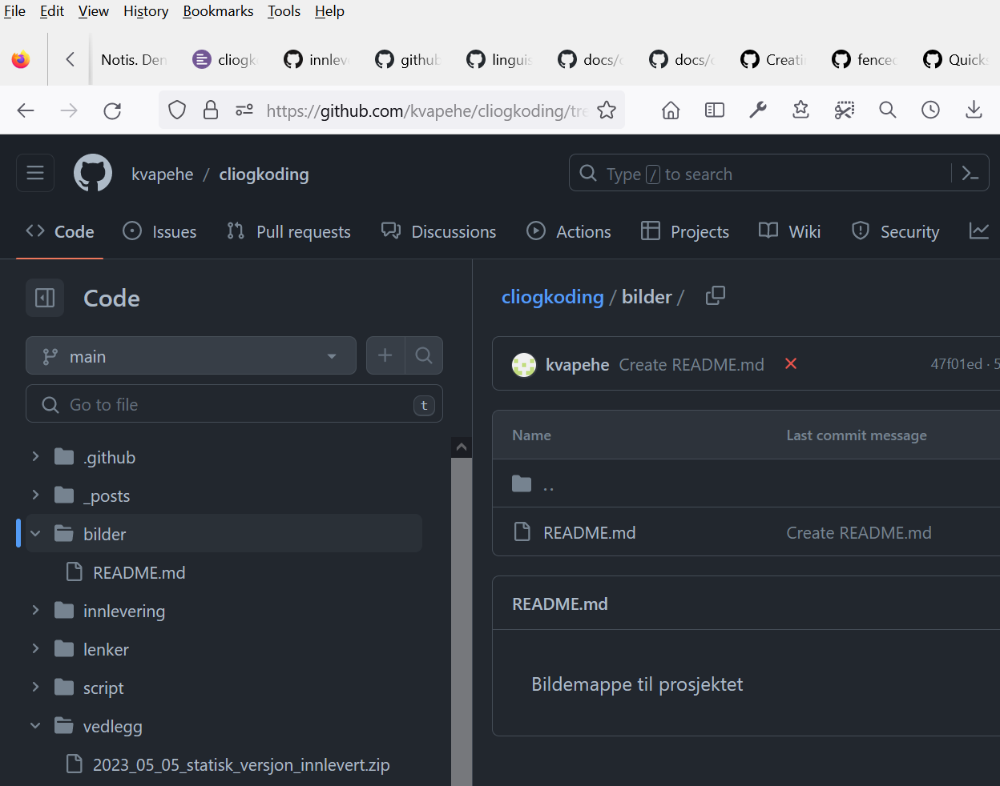

# Innleveringssiden
Dette er et litt interessant eksperiment. Det går ut på å droppe en rapport i Word-format og heller lage en dynamisk side på nett. Målet er å se hvor avansert siden kan bli ved bruk av Markdown-kodin og verktøy på github. Dette målet er i tillegg til å lage et opplæringsverktø for CLI og koding.
## Navigasjon
### Tilbake til toppen
- [Hovedsiden](../README.md)
### Innlevering
- [Innlevering] *
- [Innlevering del 2](./innlevering002_lite_tekst_noe_kode.md)
### Scripteksempler
- [Script](../script/README.md)

# Introduksjon
Blir det mye  lese så se på hver overskrift til det er interessant innhold.   
Da det er CLI og koding som på sett og vis er temaet, kand velge menyvalget Script om du ønsker det.  
Det er helt klart innholdet i innleveringen kunne vært annerledes, men så er det dette med, hvorfor er teknologien og verden slik den er i dag. Det er litt kjekt å grave litt i dybden på dette og forsøke å forstå hvordan noe virker og hvorfor det "tilfeldigvis" ble slik det er nå.

Dette dokumentet er nok ikke så brukervenlig, og tjener mer som vedlegg til elever som vil vite mer, grunnlag til å lage powerpoint, grunnlag  til å legge ut info på en nettside eller ganske enkelt en referanse som lærer kan benytte.  
For min del som underviser i dette, så handler det om å lese gjennom alt, velge ut litt og litt tema, la elevene prøve seg fram med ulike kommandoer og oppfordre de til å dele kommandoer som de finner ut av, langt mer enn det å følge et striks opplegg.  
Tenk på de demonstrasjonen vi har hatt underveis i kurset, det kan godt hende det er et manuskript bak, med det fikk aldri vi se. Interaktiv læring er noe jeg har sansen for, langt mer enn statiske powerpointdokumenter. 

## En alternativ tilnæriming til prosjekt
Det handler om å bruke en LMS slik som itslearing aktivt og la elevene selv legge ut info til alle, eller ganske enkelt å opprette et dokument på https://framapad.org 
som på et vis likner på google docs, men der alt er skrevet med markdown. For mer info om framapad og framasoft sin visjon følg denne lenken https://framasoft.org/en/association.  
https://framasoft.org/ har en rekke filosofier og verder det kan være lurt å se mer på. Lykke til i din seøken etter mer kunnskap.

## Et eksempel på bruk
Her er et slikt eksempel om en vil se en bruk av framapad https://annuel2.framapad.org/p/kvaelektronikk. Denne ble opprettet for en VG3-klasse og elevene oppretter 
når det måtte være slike dynamiske dokument, og så deles lenker i f.eks. discord eller itslearning. Om en ikke lager en bruker på framapd, så lever denne kun i 365 dager om en ikke endrer på noe. 
Om en har statiske dokumenter ingen endrer på da forsvinner de, og det er kasnkje like greit. (NB Det er naturligvis mulig å lage statiseke dokument om en logger inn med en bruker, men da forsvinner litt av vitsen
med en så lav brukerterskel som mulig. Dersom en ikke kan noe om markdown, kan en bare sette i gang å skrive og bruke verktøene en får tildelt, og så kan en utvide kunnskapsnivået etterhvert.

Lenken over er det planen alle elever på elektronikk får ansvar for, siden det er en del av dokumentasjon til et prosjekt klassene har vært gjennom og som elever nå leder på egenhånd. 
Her var målet lærer skal ikke vite noe som helst, skal ikke kunne noe av innholdet og skal ikke legge føringer (bommer naturligvis alltid litt på dette, 
spesielt om det er tidsfrister inni bildet 17. mai er en slik frist.).

Det lærer kan gjøre er å komme med forslag og innspil til elevene og så kan de velge å lage det eller ikke.  
Noe som er artig er at flere elever jobber med dette på egen fritid uten å se på det som lekse, og da er mye oppnådd.  

# Hurtigversjonen 
(Om du ikke orker lese så mye og vil komme rett på sak)
Bruk denne lenken og les på engelsk:  
https://www.howtogeek.com/168896/10-useful-windows-commands-you-should-know/  
På denne siden finner du garantert flere lenker å følge. Når interessen er trigget kan en lett svi av timesvis og dagevis med å lære seg litt om cli.

## Hvorfor dette valget
Til nå har alle rapporter og annet innhold blitt skrevet i f.ek.s odf eller .docx. 
Nå vil jeg prøve å skrive dokumentet i markdown, for å se hva som er mulig å få til 
Dette i tillegg til selve prosjektet som er ulike scriptfiler. Det er ofte slik at et prosejkt avler et annet, og ved å lage dette prosjektet er tanken det kan benyttes omigjen i en annen form.  
Tanken er at Det som er på github også kan konverteres til Word om det er påkrtrevet. (NB har ikke testet enda, men regner med framapad blir involvert i den prosessen.)

Det kan hende det er vanskelig å lage innholdsfortegnelse med markdow, men tror det askal være mulig. (tja er det nå det på github?)

Hvorfor gjøre det slik, vel det er en innleveringsfrist 2023-05-05 som skal overholdes. Der legges det inn en
zip-fil med alt innhold, og så er det tanken å referere til dette stedet, slik at en evt kan bruke filen som er levert, til å peke hit.

Her vil dokumentene, script, annet innhold bli kontinuerlig vedlikeholdt, enten dette er pga. skrivefeil, eller nye ideer.
Det kan hendee det bryter med retningslinjene for innlevering, så naturligvis finnes det et statisk dokument i tillegg,

## Årsaken til å velge CLI er at det ville være gøy
Det er gøy å vise elever eller andre hvordan en kan utføre noe i CLI.  
Det er altfor mange elever som ikke kan bruke tekstverktøy med en datamskin, på tross av at dette de siste 50 årene er
det foretrkne verktøyet for alle som aktivt jobber med en datamaskin. For å utdype dette litt er det greit å definere hva en datamaskin er.

### Datamaskin
En datamaskin er en enehet som har programvare lastet inn på maskinen, detn har en mikroprosesser i motsetning til en mikrokontroller.  
Les på nett om denne forskjellen. Datamskinen har minnetilgang og et lagringsoråde. Siden den har tilgang til slike resurser er naturlig neste steg at maskinen har et operativsystem.  

### Operativsystem
Operativsystem eller OS, er en litt uklar definisjon. At et operativsystem er MS DOS er kjent, at et annet er Windows er også delvis kjent, 
men hvilket system bruker f.eks. en maski fra Machintosh. OSX er mer uklart som operativsystem det samme er IOS på Apple telefoner,
men alle regnes som operativsystemer. For å gjøre det enda mer uklart så har en ordet linux som er et delvis ordspill på Uni(ik) / Min(IX)
og opprinnelig forfatter Linus Torvalds fra Finland. Dette er ikke et operativsystem, selv om en liker å kalle det det.

Linux er i grunn kun kjenrne i operativsystemet og på den måten kun en liten del, men delen er så sentral og vikig at en har latt det bli 
"navnet" på et operativsystem. Med linux snakker en mer om distribusjoner, og Debian, Ubuntu, Android, Mint, Mandrake ... er alle former for linux-distribusjoner.

Når en da drar i begrepet operativsystem er det enda vanskeligere å fortelle hva CLI er. NB for mye mer omkring dette søk på nett etter kilder.
Ofte når jeg skirver dette er et godt utgangspunkt Wikipedia fra Wikimedia Foundations. På denne mpten unngår jeg å referere knstant til steder.
Tnakene er å være så presis i ordlyden at en kan velge to - tre av ordene og utføre et søk og at en da skal hanvne på rett sted. Prø f.eks. med et søk på 
Wikimedia foundations og det skal kun dukke opp en reeel og original kilde. NB testet 2023-05-04 for å se selv.

### CLI eller Command Line Interface
CLI eller på norsk kommandolinjegrensesnitt er et langt og komplisert ord. 
Dette er en fellesbetegnelse på tvers av enehter, datamaskiner, switcher, routere, smartklokker, telefoner og alt mulig annet som har eller kan ha et operativsystem.
Det som er oppgaven til CLI er å kunne ta i bruk tekstskrvne kommandoer (oftest på engels om med delvis engelske ord) og så gjøre dette om til handling.
Selv handlingen kan være "lik" på ulike Operativsystemer (OS), mens kommandoen kan være ulik.

Et eksempel kommandoen for å lage en mappe i CMD/BATCH brukt av bla. Windows er md eller mkdir. I linuxsystemer og også i Unix-systemer er den samme kommandoen mkdir.  
Mao ulik kommmandon, men lik handling. Kommandoen cd finnes både i linux og cmd. CMD er videreutviking av MS DOS, og dukket kun opp å Windows NT på 90-tallet.
CMD var fra utgangspunktet 32 bit mens batch stoppet på 16 bit. I dag er systemene på linux og Windows 64 bint, men svært mange kommandoer er fortsatt 32 bit.
Det er først med Powershell Microsoft er på vei bort fra 32 bit, og hele Windowssstemet er gjennomsyret av 32-bit pgrammer og kommandoer.
Da 16 bit var i bruk fantes det i tillegg til CMD noe som heter .com, og .com er en forkortles for kommando. Denne kommandoen kjøres direkte i minne og kunne i grun utføre alt mulig.
Så vanlig var com at CLI på den tiden het command.com. I dag er dennne erstattet med cmd.exe, og det er dennne endringen som har ført til det i dag heter cmd i Windows.

### Filosofi om bakoverkmopatibilitet
Det er sjelden Microsoft gjør noe uten at det på et vis skal virke med noe som var tidligere, og i CLI er dette forsøket eller handlingen at kommandofiler har etternavnent .bat,
og at 32-bit versjonen har .cmd. Nå med Windows 10 og Windows 11 er strengt tatt .bat ute av verden, men det virker fortsatt. .bat er strengt tatt kun 16 bit, men her "ser Windows litt gjennom fingrene med det.
Det er .-bat som er brunnen til det heter batch-filer o, batch script og batch-programmering. Du anbefales likevel å kalle alle dinne batch-programmer .cmd, for plutselig slutter .bat å vuirke.

I linux så brukes det ofte sh(ell) eller bash(ell) og søk på internett ffor hva bash egentlig betyr. DEt er et mål å ha denne oppgaven så kort som mulig om eksterne detaljer, og heller ikke lenke til evt. slike
for å holde mengden noenlunde i sjakk.
I linux finnes det en rekke andre metoder enn bash som csh, zsh, ksh, sh, bash og nok en lang rekke andre. Mellom de ulike shell (sh betyr shell) og bash er en fomr for shell så er det mye som er likt, og s er noen detaljer ulik.
F.eks. med csh ligger det c og c++ i bunn så her kan en nesten skrive c-kode direkte i shell og så virker det. med .cmd er det langt "vanskeligere eller mer omstendelig å skrive kode i shell eller cli.

## Historie
Mange av de ulike CLI har lang historie, og prøver å alltid være bakoverkompatible. Med linux er det lettere å forlate en mtode fra tidligere når det finnes en "ny og bedre" metode.
et slikt eksempel er ifconfig som setter opp informasjon om nettverkskort som er forlatt og byttet ut med ip. En ekvivalent til  Windows er ipconfig som lever i beste velgående.
ip er en vanskeligere kommando å benytte med langt mindre hjelp, og på den måten "dårligere" men om en lærer seg ip så har en et langt kraftigere verktøy.
Det fine med ulike os, for fra nå av for enkelhtsskyld velges det å si linux er et OS slik Windows er et OS er at når en lærer et så lærer en på sett og vis et annet, spesielt om de ulike OS deler filosofier.

I dag er det rart linux er så ukjent siden 95% - 99% av alle OS i dag er linux, sel når en vet hvor stor Windows er. Fo å si det slik må en strekke dette med linux litt.
Adroid på slike telefoner er en linux-gren, mens IOS til Appple er mer en Unix, men det kunne like gjerne vært linux. Når en tenkter på alt av apparter som TC, kjøeskap, kalkulatorer, vidftestyring, varmestyring,
flyplasser, busser med inforskjermer, "smart"-klokker og så mye annet alle benytter linux, da forstår en litt mer hvorfor det er så mye som nesten hundre prosent linux overalt.
Likevel er det ukkjent for mange.

## Hvorfor linux
Om en vil drive seriøst eller utføre mye uten restriksjoner. Restriksjoner betyr her uten at OS hindrer deg i å utføre en oppgave) da velger en IX Unix eller Linux.
Med Windows er det en rekke detaljer som ikke kan gjøres, slik det er med Apple iphone. Med OSX som betyr både OS versjon 10 men ogs OS basert på IX er det mindre restriksjoner.
Ved å dra det litt langt kan en si OSX er linux (NB her får jeg nok litt pepper) men poenget er at kmmandoer en bruker i IX er like, ikke at alt er linux.
BSD, FreeBSD er typer Unix men for meg som "slutttbruker" er det større variasjoner mellom ulike linuxdistribusjoner enn mellom en mskin med Unix og Linux, så for enkelhtssksyl la oss si det er linux.
For å si det er IX er litt tungvindt. Fra starten av (se på nett om du finner årstaller / dato) het det ikke linux eller lus torvalds IX / UX men noe annet.
OG i dag heter det faktisk ikke linux men GNU linux. Gnu er all programvaren som utgjør omperativsystemet og linmnux er kjernen.

<details>
<summary>`Klikk for mer innhold`Litt om linux og gnu</summary>
I dag er GNU delen mer ukjent, men spesielt på lisensdelen er GNU viktig. Det at noe er åpen kildekode eller på engelsk Open Source som free/fri 
programvare, og litt med fri som gratis programvare, men ikke nødvendigvis, er en filosofi til GNU
Derrfo heter en av de kjente lisensene GPL og LGPL eller GNU (General Public License og LGPL er Lesser GPL). Innenfor GPL er det en rekke restriksjoner og føringer som gjør at linux har blitt så populært.
OG langt obvergår alle andre OS eller systemer som har det en kan tenke på som Proprietære lisenser, og har restriskoner for sluttbruker.

På grunn av denne åpne modellen er linux tilgjengelig overal, hvem som helst kan fikse på noe med linux og så gi denne ut videre. Om lisensen er GPL må en ta med kredit på opprinnelig forfatte
legge ut egene versjon med samme lisenstype. En kan med andre ord ikke ta noe fra andre, modifisere det å så gi ette ut med andre premisser enn en har fått innholdet selv. 
På denne mpåten sikrer en at noe som finnes alltid er tilgjengelig, og om opprinnelig forfatter lar være å utvikle noe, så kan hvem som helst andre hente det fram og videreutvikle det.

I dag er svært mye av programvaren med slike lisenser, og det har vært en hard kamp å kjempe for denne modellen. Igjen søk på nett om du vil vite mer.
KAmepen for OSS startet på tidlig 90-tall (muligens litt før pga GNU) og pågår fortsatt. I dag har mage store organisasjoner tatt i bruk OSS-programvare Open Source Software)
Og kanskje kjenner du til VLC eller VideoLan Codek. Nå finnes VLC på omtrent alt av enheter som kan spille av video eller vise et bilde og det er fordi dette er lisensiert med GPL.
</details>
### GPL
Å nevne GPL uten å ta med en annen person som har hatt stor betyding i tilleg til Torvalds er Richard M. Stallmansom på tidlig 80-tallet ville lage et operativsystem.
Stallman var godt kjent med Unix og det meste innenfor Unix var både kostbart og lukket programvare, så med idene om å lage som som er fritt tilgjengelig kom på plass omtrent samtidig med Microsoft startet med sin DOS-satsing
og med en helt annen filosofi. MS sin filosofi gjøre ulike eiere og topppersonell ekstremt rtike på penger. slik at det fortsatt i dag er blant de rikeste i verden, mens Stallmans filosofi hadde en langt lavere inntektsgivende situasjon.

I dag er det artig å se det er langt mer verdier i åpen programvare enn i lukket programvare, og faktisk tar i dag også militæret i bruk OSS framfor egenutvikler lukker programvare, slik at alle argumenter mot dette er i ferd med å visne hen.
Uansett da Gnu hadde vært i bruk en ca 10 års periode dukket linus opp med sin kjerne og GNU programvaren, slik at en kunne lage et operativsystem ut av dette. Det er artig å tenke på Lius kunne havnet på laget med Apple,
og at det var ulike filosofier som gjøre dette gikk i en annen retning.

## Linux Linus og GIT
Hvoran lager en en linuxkjerne som skal være stabil... Jo da må en lage et system som har kontroll på det som lages. Da fant Linus ut at eksisterende programvare ikke kunne gjøre det 
som er ønsket, slik at f.eks. CVS, Mercury eller SVN for å nevne noen systemer ikke var god nok. Linus lagde like gjerne GIT for å ta vare på alle endringer i liux-kjernen og i dag bruker
"alle git" selv dette er skrevet med git på github. Framfor i Word. Litt for gøy og litt for å ta "vare" på alt underveis.
Det en kan se det er en del enkeltpersoner opp gjennom tiden somhar fått enorm betyding for hvordan livene med teknologi leves i dag.

# Et lite sprang til WWW eller HTML eller HTTP
På 90 tallt ble internett "revolusjonert" fra slik det var før 90 og etter 90. Da dukker WWW opp eller det en i dag tenkter på som internett. var med å lage html for Cern. Let på nett for mange flere detaljer.
<details>
<summary>`Klikk for mer innhold`Hva har Cern med OSS, linux og GNU å gjøre</summary>
Da de på Cern ville ha et dokumentsystem som gjorde det langt lettere å holde rede på alt mulig og kommunisere med hverandre dukket html opp. Det var ikke denne personen som strengt tatt fant opp HTML da det fantes SGML som HTM er hentet fra fra lang til tidlbake.
Det som derimot er en "fellesnevner for personen nevnt over er at de kjente til dattidens teknologi og var i stand å lage noe fra dette, uten å kopiere eksisterende systemer. De gjorde dette for at det skulle være fritt tilgjengelig
og at hvem som helst skal kunne både bidre og endre på det. Dette kan virke rart å få til, og være litt anarki-aktig, men det virker likevel, pga en rekke styringsmekanismer. En er at "ingen"er interessert i å "ødelegge" noe, en vil hele tiden endre på det for å få det bedre,
når lisensmodellen tillater det og krever at din endring leveres ut med samme lisens, så kan ingen ta arbeidet, lukke det og så tjene på det selv, en måp dele eet videre. Dersom noen har ødelagt noe, kan alle se dette og si det er ikke godt nok og så endre på det,
slik at sluttproduktet blir bra. Slik er det bla. med linux, og de ulike distribusjonene er ulike verdier og filosofier.
Den jeg kjenner best til er Debian og delvis Redhat. Redhat har og hatt en filosofi som gjøre den mer utilgjengelig for alle, men i berdiftsmarkeedet er den mer utbredt. De lover litt som MS support til sine "kjøpere", men de må også gi ut mye med GPL da de har hentet fra GPL, men alt annet kan de lukke om de øsnker.

Debian i motsatt ende har den helt motsatte filosofien. Der skal alt være åpent og om det ikke er det blir det merket tydelig, og så skal alt være stabilt og gjennomprøvd. Dette fører til litt saktere utvikling, men svært sjelden feil på OS,
dette fører ofte til svært stabile systemer og med lite eller ingen restriksjoner så blir det utbredd. Muligens er Debian den linuxdistribusjnen som har bettydd mes for linux til nå, og om en tenker på Android eller Ubuntu eller Raspberry OS så har alle utspring fra Debian og slik debian til enhver tide er bygget opp, slik er disse andre systemene bygget opp.Igjn om du vil gramve videre så søk på nett, men denne gangen litt tips. Ta med ii søkeordene linux distribution wikipedia så kan du see litt av bildet
velger å være litt snill. HEr er lenken jeg regner med di ville funnet med det "presise" søøket. https://en.wikipedia.org/wiki/Linux_distribution. Fint å tenke på søk på engelsk er ofte presist innhold og omfattende. Like så med tysk. Når du søker på norsk får du ofte mye bra, men manglende, og så er det ferre som bidrar. Og om du lurer, ja det er linux og OSS i bunn.
</details>

# Oppgaven skulle handle om CLI, men her er det lite så langt
Dette dokumentet skal ikke vise så mye CLI annet enn som vedlegg eller lenker til kode. Mye av koden er kommentert og kan brukes slik den er.  
Målet er at koden skal virke om du kopierer den til egene maskin og med rett programvare eller OS.
Hvordan det lenkes når alt er på github er et av eksperimentene jeg vil utføre, men som tips i scriptmappen ligger mange cli og script.

Her er kun en smakebit.
Til info dette dokumentet er ikke noe som nødvendigvis leveres ut til elevene, men info som lærer kan gi elever i mindre posjoner, evt være med å lage en video sammen med elever om de øsner det. 
et er heller ikke noe som skal leses suksessivt, og overskriftene skal si om du vil lese videre eller ikke. Om ikke overskriften er dekkende skal første setning under hver overskrift hjelpe deg.

## CLI i Windows
og hvordan gjøre dette i Windows så brukes CMD eller powershell. Nå er fokus CLI med batch og cmd
For å lære noe må en hvite hvordan en finner dokumentasjon og hjelp.
I Window er kommandoen `help` et godt utgangspunkt så prøv denne.

<picture>
 <source media="(prefers-color-scheme: dark)" srcset="YOUR-DARKMODE-IMAGE">
 <source media="(prefers-color-scheme: light)" srcset="YOUR-LIGHTMODE-IMAGE">
 
</picture>


Så er det slik at de fleste kommandoer svarer på hjelp med følgende argument og parameter. `/?, -?, -h` og `/h` på linux er det `--help` og `man` kommando som gjelder.
Dersom det ikke finnes hjelp f.eks. med kommandoen `msinfo32 /?` så kan det hende du sendes av gårde til en nettside, og på søk på nett kan en nesten skrive navnet på hvilken osom helt kokommando 
og så si help, howto, documentation eller liknnde og så kommer en til kilden, wikipediartikker, stackoverflow, limewire, geeksforgekks o.l. og der er det ofte god og strukturert hjelp.

Nå slik det har vært en stud vil mange ta i bruk GPT, ChatGPT eller liknende AI-systemer og selv om det kan være forlokkende og enkelt i starten er det ikke alltid det beste valget.
Det å spandere litt mer tid, lese artikkler, prøve å finne kilden, gjerne se en video eller annet er langt bedre, og langt riktigere. men uansett det å jobbe med CLI uten å kunne kommandoer eller måter en benytter det på er krevende.

Derfor er målet nå å gi deg mange ord du kan søke videre på, og en del kommandoer.
Her er noen kommandoer. `cd, md, dir, help, net, ping ipconfig, more, find, findstr, route print, copy, mode, del, tree, type,` ...  
Mange av disse finner du med help og trykke enter.

Gi deg selv oppgaven du skal lære deg 5 "nye" kommandoer hver dag fra listen fra help. Her er en du kan prøve deg på. Velg skrivebordert i Windows. Finn ut hvor det er på din PC (hint ditt brukernavn og Desktop)

### En oppgave å starte med
Start opp `cmd` naviger til mappen du lagde på skrivebordet `..\...\...\` ... `Dekstop\minmappe`  
(NB ikke mllomrom eller æ ø å i filnavnet virker litt, men lurt å læ være disse og det har MS også forstått. Med XP gjorde de mange slike tabber og noen lever videre i dag)

Nå i denne mappen via `CMD` gjør følgende. `md` eller `mkdir minhjelpelistemappe` (du kan endre nanvnet siden) inni denne mappen som du navigerer til med `cd minhjelpelistemappe` Når du skriver kan du bruke noe som heter TAB-completion eller navigere med TABULATOR-tasten (virker bedre i linux enn i Windows) Du bruker TAB slik skriv `cd min` og trykk `TAB` så får du hjelp.

Nå er du i mappen `..\.\Desktop\minhjelpelistemappe` og du bruker kommandoen `dir`. Mappen er tom, men ikke så lenge. Skriv dette i mappen når du er i `cmd`. Her vil du for første gang så langt se at CLI er bedre enn grafisk modus. Til nå kunne du laget alt med Windows utfosrker eller explorer.exe. Skriv kommandoen `help >> minhejlperapport.txt` Du har nå laget en fil som var innholdet du kunne se på skjerm med help. Denne kan åpnes i notsiboken slik `notepad minhejlperapport.txt` Eller i Word om du øsnker det. NB med CLI bør du ha en bedre editor. Derfor gå til https://ninite.com og finn programmer du vil bruke. 

### Hjelpeprogrammer i CLI-verden
Ikke bli overrasket om mye er er OSS. Bla er `Notepad++` eller `Visual Studio Code` noe du kan benytte og `VS-code` har `python` i bunn så alt mulig rart kan gjøres med utvidelser. `Notepad++` har også mange utvidelser, og det er greit å ha begge.

Annet som en kan tenke på fra `ninite. winmerge, notepad++, putty, 7-zip, vlc, windirstat, python, visual studio code` er alle programmer du kan hente fra ninite. 

Fakstisk er det lurt å bli litt kjent på `niite.com og sf.net` når du er i gang.
Og vil du ta det helt ut og nesten gjøre ant i CLI kan du leke med chockolatey. da skriver du f.eks. choco firefox og så legges Firefox automagisk inn på din datamaskin med Windows OS. sæk på nett om du er interessert.

## Klar for neste steget i CLI-verden
Nå har du som "del av kurset laget og brukt dine første CLI-kommandoer, og du burde starte med help så slipper du å lese mye av det over eller "huske" kommandoene. Nå når du har sett en 10 - 15 kommandoer så finnes noe liknende i linux.


Du kan utføre liknende oppgaver i linux som i Windows. Men disse kommandoene er "kjedlige" og lite "automagiske slik de er nå. En må ta de med i `batch`-programmer for å få mer gøy med de. Er du dyktig å programmere kan du legge kommndoene på din egen USB-penn og så kjøre de på ulike mmaskiner
met et tastetrykk. NB pass på sikkerheten både din egen som bruker noe du har hos andre, men også for de som tillater du bruker din  "magiseke" USB-penn andre steder.


Her skal du få en kommando som er "kraftig om du har en bærbar PC. NB for å få tilgang på alle kommandoer må du sarte CMD med Administratorrettigheter. (Dette er fordi det må være sikkerhetsrestriksjoner) 

Du skal få et scipt en cli line som nesten kan hente ut passordet på alle trådløse nettverk maskinen din eller maskinen du kjører kommandoen på er tilkoblet eller har vært tilkoblet. Du får ikke alt da det er en sikkerhetsrisiko, men om du selv kan lese litt hjelp finner du ut av det.
Kommandoen `netsh` som kun finnes i Windows og tildigere kun i W7 og nyere er nå nesten standardverktøy for mange brukere som bruker trådløse tilkoblinger. Det er mulig med andre kommandoer, men `netsh` gir skikkelig god og presis teknisk informasjon.
Her er den interaktivt. da skriver du en kommando trykker ENTER for hver gang. 
```batch
netsh
wlan
(help)
show
profiles
(help) ...
```
... Mer får du ikke. Nå får du en annen versjon av samme kommando
netsh wlan show profiles >> minnettverksprofilllistemedwlan.txt
Regner med du forstsatt er i samme mappe som tidligere, om ikke så naviger dit. OG NB husk du er Administrator eller superbruker eller på linux (root) slik at det er få restriksjoner om du gjør noe feil.

### Er CLI bare bra eller er det noen problemer med dette
Noe som er ulempe og fordel med CLI er at du må å være ekstremt presis. Kommandoen `del` brukt feil på feil sted kan fjerne mye data på noen få sekund.

Her er en men NB vær forsiktig og skriv dette først og forså alle linjen du bruker. `del /?`
om du navigerer langt opp i systemet ca Dektop med `cd .., cd ..  cd ..` mange ganger eller `cd \` én gang da er du på toppen eller det som kalles rot (rot som i trerot) prøv kommandoen `tree` her og du får en "visuell" struktur som naturligvis kan kombineres med `>>`
og en rapport. Kanskje du har skjønt hva `>>` betyr nå. Denne spesialkommandoen som også er i linux (noe mer avansert) er redirect eller noe som sender noe fra et sted til et annet sted. med `help >> minfil.txt` så sendes det fra skjermen som kalles CON til filen `minfil.txt` som kan åpnes med `notepad minfil.txt` om du vil. NB bruk alltdid to stk `>>` og ikke med en `>` til du forstår forskjellen. Det er tryggest. 

### Nå til dette at `del` er langt "farligere" enn `netsh` over.
Les noen flere kapitler under før du bruker `del`-kommandoen.
Denne kommandoen `del \ /F /S /Q` bør du aldri bruke, og i allefall ikke om du har startet `CMD` med Administratorrettigheter (Windows kaller dette Elevated rights eller utvidede rettigheter) 

Om du bruker kommandoen del over og lar den kjøre *2 - 5* min kan det hende du
i verste fall må kjøpe ny datamskin siden du nok ikke klarer å fikse den. Om du klarer å fikse den ville du nok ikke kjørt `del` i utgangspunktet.

Om du vil teste kommandoen så lag deg en virtuell datamskin eller sett opp en helt egen maskin som du vil teste på, for det er lurt å kunne kommandoen. Selv bruker jeg den _aldri_ slik. Har aldri gjort det og kommer aldri til å gjøre det. Om jeg vil gjøre noe med en slik kommando bruker jeg heller `format` eller `diskpart` i Windoows og i linux, kanskje `rm -Y /` (men igjen "superfarlig" om du ikke vet hva du driver med. 

## Hvorfor vise noe farlig til en ny bruker
Det er greit å kjenne til kommandoen så du kan kjenne de igjen senere og bruke hjelp første gangen du har behov for den. Og er du usikker på hvordan du bruker hjel så prøv med `dir` og `ls`,
Søker du på internett etter noe slikt får du garantert mange treff, både fra fortvilte brukere men også de som sier det er bare en spøk. Burde jeg fortalt deg dette. Ja, jeg synes det for du har rett å vite om det, men ikke nødvendigvis rett å bruke denne kommandoen ...

### Mulige kommandoer og historie
Det er mye som er mulig, men ikke nødvendigvis like lovlig eller like lurt alltid. Jeg lærte selv kommandoen `rm` rundt 1994 og `del` og `deltreee` ca. 1988 - 1990 og har testet noen liknende etter doumentasjonen ble lest (da fantes ikke helep) kun en evig stor bok på ca. 700 sider med "all" info om DOS 5.0 og `dosshell` og `doskey` som ble bedre med DOS 6, DOS 6.2 og DOS 6.22. DOS 7 finnes, men hold deg unna den. Windows 95 kom på den tiden og Window NT var i gang får det. Windows 10 i dag er Windows NT vversjon 10.

Bruk kommandoen `msinfo32` eller i `cmd ver` (version) så ser du teknisk navngiving. Selv har jeg aldri prøvd Windows 11 så vet ikke hvordan den blir presentert. Noen elever har testet den og noe er annerledes, men det tekniske er ikke endret så mye så en finner ikke alltid det en skal.

Windows er ofte kompatibel med tanke på kommandoer, men grafisk, der ser det ut som de aldri kan bestemme seg. Merket det senest nå mai 2023 en kommando jeg visste skulle finnes, ikke var tilgjengelig på en enkel måte. Brukte ca 10 min for å finne denne, og det plager meg MS tar bort noe for å lage noe annet. Om de vil det kan de like gjerne la begge metodene være tilgjengelig så kan brukere si hva en foretrekker.

## CLI cmd, wmic og powershell (Windows)
Nå har du fått en input og introduksjon til CLI og Windows. Kaskje du vil se noen kommandoer fra Powershell. Dette kjenner jeg mindre til, men tanken her er at "alt kan programmeres og alt er objekter".

Det å benytte objekter kan være en stor fordel, for til nå har kommandoene for det meste produsert og jobbet med tekst eller string eller på nosrk strenger. Det er fint å se tekst i en rapport,
men konseptet med objekter gjør at en kan kombinere kommandoer enkelt. *Her er to versjoner. for å vise serienummeret på din datamskin. Om du har en bærbar PC fra en produesent som Dell, Lenovo, HP o.l.
så har de med stor sannsylnighet skrevet inn serienummeret, produksjonsnummer, modellnummer o.l. 
Nå skal du få en CMD-kommando (som er delvis utgått, men tror den virker med W10 og kanskje med W11)

Den samme kommandoen som virker med cmd får du også med powershell-metoden.
Det er ikke alt jeg kan her så her er søket jeg brukte for å finne info, og så er det bare å se gjennom noen av treffene. NB se tidligere kilder som limewire, geeks, o.l. for dukker de opp er innholdet ofte bra.

Søket: __powershell windows serial number__ Fant svaret hos howtogeek.com (enda en god kilde) så jeg vet det er riktig svar og her CMD versjonen: 

### CMD-versjonen av noen kommandoer
```batch

wmic bios get serialnumber 
eller 
wmic baseboard get Product :: (Denne viser hovekortet som er i datamskinen)

```

Kanskje du vil ha informsjon om harddisken eller annet i mskinen: 
```batch

wmic diskdrive get model,name,serialnumber

```
Du ser kanskje nå et mønster. Tips se på linjene under.
```batch

wmic bios get serialnumber  
wmic baseboard get Product  
wmic diskdrive get model,name,serialnumber  

```
Kommandoen `wmic` (let på nett) spør maskinens `bios`, (systemet før OS), hovedkortet (HW-kort, dvs deler av maskinen rapporterer til OS hva som finnes. NB denne lærte jeg nå underveis) og `diskdrive`, som gir informsjon om lagringsmedia.
Ordet `diskdrive` er nå misvisende da en __SSD__ (solid State "disk" ikke lenger er en disk men et slags minne. Kalles ofte NAND-minne (søk på nett eller om du kan litt elektronikk så skjønner du hva det er) Uansett så har Windows kalt det disse ordene så da bruker en de. Og dersom du lurer på om noe liknende finnes i linux så er svaret ja. Faktisk er en tilsvarende kommando med i script-eksemplene.

En kommando jeg har glemt oppi dette og som også finnes i linux er `netstat -an`. 
Du får nå se "alt" om din tilgang til internett.

Var innom kommandoen `del` tidligere. Her er en nettside som omhandler `del`
https://www.howtogeek.com/742224/how-to-delete-files-and-folders-using-command-prompt-on-windows-10/ 

Her har du enda noen du kan leke med
https://www.howtogeek.com/164484/10-useful-system-tools-hidden-in-windows/
OG IGJEN VÆR FORSIKTIG MED NOEN AV KOMMANDOENE. de kan gjøre stor skade om du er uforsiktig.

## Powershellversjoner av de samme kommandoene som i CMD 
I Powershell så bruker en mer kommandoer som i ulike programmeringsspråk. Powershell er for det meste basert på .NET som er MS versjon av javascript. Historien bak dette er interessant å lese om du ønsker det. Når MS finner på noe er det uklart i hvilken retning det tar. Da MS hadde en form for .js (javascript ble det bråk mellom MS og opprinnelig utgiver av .js) MS kalte sin versjon .jscript og etter å ha tapt denne "krangelen" laget MS .NET eller c-sharp som forkortes c# .NET er for det meste basert på c#, og i dag er c# et stort og omfattende programmeringsspråk.

En kan spørre seg om c# er mer java enn javascript eller om det likner med på c++, og det er det som er tanken. KAn en noen av disse språkene skal c# være greit å jobbe med. Tidvis er MS dokumentasjon mangelfull så det er krevende å benytte c# eller .NET og Powershell er ikke noe unntak.

Når en såkommer inn i det er Powershell et kraftfullt verktøy og i dag kjører naturligvis en versjon av dtte også på linux. Mye av utviklingen hos MS er nå linux-programvare.

Alternativet til wmic er `Get-WmiObject win32_bios | select Serialnumber`. (NB virker ikke med CMD). 
Her må du velge `WIN+Q` og så ordet `powershell` eller du må endre på standard shell/cli i Windows.

Kommandoen for å starte `powershell` fra `CMD` om du vil det er `powershell`, men det er ikke så lurt, for du mister litt av egenskapene til programmet/cli-verdenen/programspråket `powershell`. 
Det virker å starte `powershell` fra `cmd` så det er et valg du tar selv.

Med Powershell så kan vi prøve å lage `like` kommandoer som med `wmic`
```powershell
Get-WmiObject win32_bios | select Serialnumber
```
eller prøv denne og se forskjellen mellom `wmic` og `powershell` som nå benytter objekter.

Du kan om du vil hente objektet fra `powershell` rett inn i `python`, og MS har laget en `powershell` som er OSS.

Lenken dit er: __Try the new cross-platform PowerShell https://aka.ms/pscore6__ _aka.ms_ er forresten en spesiell adresse som MS bruker ofte. __microsoft.com__ betyr kommersiell og er ofte i USA. _us_ er lik vår _.no_, men MS mener de er så store at de kan brke _.ms_ (Montserrat), slik en bruker _.as_ i Norge for å indikere et akseselskap. _.as_ er forresten Amerivcan Samoa og slike domene salg av toppdomener er en stor industri på denne øyen. 

I starten fantes det ikke mange domener slik at `.net, .org, com, gov` o.l var de som fantes i tillegg til mange lands domener. `.de` er Tyskland, England er litt rar med `.co.uk`, `.or.uk` o.l. Litt slik som i USA men kun to tegn istedenfor tre tegn. I dag finnes det flere 1000-vis av domeneendelser, og IANA er et sted å lete om du vil se mer på det..

*Årsaken til det hele tiden hopeese fra CLI til andre deler er at mange kommandoer du lærer underveis kan benyttes for å nå disse stedene, hente ut info, lage rapporter o.l. for du vil snart sa at kommandoene ikke nødvendigvis er avgrenset til å kjøre på egen maskin men fort kan brukes lokalt i nettverket eller på internett. 

### En ulempe med Powershell
Fær en går videre i powershell, så er det noen ulemper. En kan ikke benytte `/?` slik som med CMD her er denne byttet til `-?`, men det er ikke alle kommandoer som støtter dette. Powershell kaller også sine små korte program for CMD-let https://duckduckgo.com/?t=ffab&q=cmd-let&ia=web og ellers er mye likt. 

Dette er en annen måte å vise hjelp på, og den er tettere koblet mot slik hjelp på en nettside vises. Her har MS lært en lekse ved at det en finner et sted skal ha samme type informasjon og lik oppbygging alle andre teder. Ofte har det vært slik at om en finner informasjon må en eksperimentere litt for å skrive den riktig et annet sted. `wmic` er en slik tjeneste som virker "nesten" ofte. Med poweshell er dette eleminert,
når en først kan kommandoene. 

Når powershellkommandoer er nytt, er det vanskelig å kunne om en ikke bruker chwat sheet (et annet ord som er lurt å lære seg) Nå er det etterhvert så mange ord så kasnkje en ordliste (uten forklaring er lurt å ta med) Ordlisten er ikke tatt med pr dd. Men den er på listen over det som kan dukke opp, det i tillegg til evt. cheat sheets.

## CLI med powershell
Starte powershell med WIN+Q powershell (gjerne som administrator om du lnsker det,og  du er forsiktig)
Nå kan det være lurt å legge innhjelp eller bruke hjelp på nett.
"Get-Help Get-WmiObject -Online" or Update-Help eller go to https://go.microsoft.com/fwlink/?LinkID=113337.
Powershell kaller forresten kommandoene for CMDlet eller commandlet og det er slags små scriptprogrammer. Om du finner de på datamsiken 
så er dette omtrent ren teksfil med kommandoer inni. Disse kommandoene er kamuflerte og ikke bergnet for sluttbruker, de er mer kompliserte en det `GET, SET` kommandoene powershell er bygget opp på. 
I `powershell` kan du bruke TAB mye mer enn i `CMD`, men ikke fullt så mye som i linux med `zsh` eller `bash`
```powershell
Get-WmiObject win32_bios | select Serialnumber
Get-WmiObject win32_bios
Get-WmiObject win32_baseboard
Get-WmiObject win32_diskdrive
```
Med videre kommandoer som over med `|` og så neste ord kan en filtrere. NB nå virker ikke `|, >>` slik som tidligere, istedenfor har powershell en rekke kommandoer 
som kan lage ulike typer rappporter, sortert ulikt, filtrert o.l.

Viser en slik kommando som en kan se måten dette gjøres.
Denne f.eks. 
```powershell

Get-WmiObject win32_diskdrive |select mod* 

Get-WmiObject win32_diskdrive # (Denne blir "uendelig" lang men bare prøv) 

```
Da slipper en se hele listen, som "alltid er formattert fint, mye bedre enn med wmic.
Her er noen tips om hvordan finne kommandoer og hvordan skrive kommandoene. 
Disse ble oppdaget underveis og benytttet
```powershell

REMARKS
    To see the examples, type: "get-help Get-WmiObject -examples".
    For more information, type: "get-help Get-WmiObject -detailed".
    For technical information, type: "get-help Get-WmiObject -full".
    For online help, type: "get-help Get-WmiObject -online"

```    

### Internettresurs til Powershell
Dette er en verdifull internettresurs for powershell:  
https://learn.microsoft.com/en-us/windows/win32/cimwin32prov/win32-diskdrive
```powershell

Get-WmiObject -Query "ASSOCIATORS OF {Win32_DiskDrive.DeviceID='\\.\PHYSICALDRIVE0'} WHERE ResultClass=Win32_PnPEntity" 

```
Her er en mer avansert kommandolinje, så la oss plukke den fra hverandre litt.
Kanskje du kjenner den igjen fra listen over.

Mer powershell og nå starter det å likne på programmering
```powershell

$filter = "name like '%"+$_Application+"%'"
$result = Get-WmiObject win32_process -Filter "$filter"

```
Om en vil se innholdet i variablene så skriv f.eks. `$result`, og det dukker opp 100-vis a linjer som en naturligvis vil ta vare på i en rapport.

Med `powershell` bør en vanligvis benytte linje to under framfor linje 1. Slik som med `wmic` i `CMD` så forsvinner `wmi` også med `powershell`.

Om du vil vite mer så søk på nett. MS har valgt å la begge kommandoene vise og virke noenlunde likt så stort sett er det nok på bytte fra 
```powershell

Get-WmiObject til Get-CimInstance

```
og fortsette som tidligere. Her er nok et eksempel før en savlutter powershell eksempler for denne gang.
```powershell

Get-WmiObject   Win32_logicaldisk -Filter 'DeviceId = "C:"' | Select-Object DeviceID, FreeSpace
Get-CimInstance Win32_logicaldisk -Filter 'DeviceId = "C:"' | Select-Object DeviceID, FreeSpace
DeviceID   FreeSpace
--------   ---------
C:       14188314624
Get-WmiObject til Get-CimInstance og fortsette som tidligere

```

## Veien videre
Kanskje en vil se python nå, men for å unngå dokumentet blir evig langt er planen å nå referere til det meste med vedlegg og eksterne filer. Før det kan det være nyttig med CLI i linux `bash`
Og kanskje en `CMD`-fil i Windows.

Kildekoden er laget og er dokumentert, så her kommer det kun noe om "hver benyttede kommando i `batch / cmd`
`@eche off`. Slå av utskrift til skjerm og `@` slår av vising av at en slå av `echo.`

Fra nå må en skrive `echo` hver gang en vil ha noe til skjerm. `echo` er litt som `print`
`for` løkke med `batch` er litt komplisert så her må en bruke `for /?` for å få hjelp.
`for` i kommanodline srives slik `for /l %i` og så likner det på for andre steder. og avsluttes med `DO` istedenfor `{}` som i andre språk.

`for i bacth` må skrivs slik som et av få steder `for /l %%i` for å virke. Dette kan det være vanskelig å fortå om en ikke leser dokumentasjonen nøye og knskje finner eksempler på nett, eller ser en video.

`goto` er omtrent eneste måten en kan hoppe rundt i programmet med `batch`. `if` og `while` er litt rduseert, og `if` bryr seg om noe som kalles `ERRORLEVEL` mer enn en test. alt i `batch` rapporterer en kode der `0` er alt OK, `-1` er noe feil og tall over 0 en kode en kan teste på.

F.eks kan en se om en fil finnes. omm svaret er jep, det gjør den får en en gitt kode, men den er ikke så viktig, for det er viktigere om den ikke finnes. da kan en søke `IF NOT EXISTS` istedenfor `IF EXISTS`,
og med svaret er `-1` gikk noe galt, og en kan gå videre derfra. 

Vedleggene nå viser ikke så mye om `errorlevel og IF`, for å redusere alt nytt, men søk på nett etter eksempler, finn et tema og se om det finnes noe.

# Avslutting og kort diskusjon
Det er en mengde sider med informsjon fra dette prosjektet, og igjen, se på eksemplene her og få hint om hva du kan søke videre etter. Et viktig tips er: 

Å lære seg script-programmering er ikke gjort på en dag eller uke. Det er noe en gjør hele tiden slik at en får det inn i fingrene, og så er det lurt å bruke det når du skal gjøre noe enkelt framfor å dobbelklikke på en fil og åpne den i notepad, eller velge gi nytt navn eller slette en fil med utforsker. bruk `CMD` eller `Powershell` og prøv på det samme der.
`::` og `REM` er kommentarer. `REM` betyr remark, og `::` er en label som er tom. Det er best å benytte den udokumenterte metoden `::` siden denne er rasekere. `REM` vil kjøre hele linjen etter `REM` og er det mye tekst tar dette tid.

`REM` vil gå gjennom linjen, men likevel ignoreree innholdet da det er en kommentar.
Utover det er det ikke så mye mer i `CMD` shell-script, selv om dyktige programmerere kan gjøre mye ut av disse byggeblokkene.

## Hva da med linux
Den samme leksen som er vist over med altfor mange ord kan naturligvis gjentas for linux, `bash, csh, sh, zsh` og så videre. Det er ikke planen nå. Bruk det en kan fra `DOS / CMD` og lær noe tilsvarende i `bash shell`.
Finn script på nett med navn `.sh` eller `.bash`, og se hvordan en benytter `if, for, while` o.l. 
Omtrent alle filer en finner på en "linux"-maskin er tekstfiler, som syr sammen mengder av andre kommandoer.
Start et `terminal`-vindu i linux og trykk på `TAB` noen ganger så ser du hva jeg mener.

Du kan lett få spørsml om du vil se alle de 3000+ mulige kommandoene som er i operativsystemet.
Ved å skrive `d` i kommandovinduet og trykke `TAB TAB` ble jeg spurt om jeg ville vise alle de 127 kommandoene som starter med bokstaven __d__. 
Systemet jeg benyttet er en Raspberry pi som regnes som relativt moderat som linuxmaskin. 

## Det er noen ulikheter mellom batch og bash
Det er en del ulikheter mellom det å benytte cmd/batch og bash eller andre sh--terminaler/miljø. Det er letter å fokusere på likhetene og bruke disse til å lære seg noe nytt, enn å se alt er nytt og en forstår ikke noe i det hele tatt. Faktisk er de to miljøene så like at måten jeg selv lærte dette er å studere DOS en gang for lenge siden mye, så teste desto mer, så vise det til noen, så få tilbake noe fra de som fikk tips fra meg. Ofte er det den du viser det til som er flinkere enn deg selv og kan lære noe til deg selv. Slik er det ofte med elever som trigger på en oppgave. De lærer seg det på brøkdelen av tiden en selv bruker
og det er langt mer avansert. Med pythonscriptet er det en elev som kom med ideen om å vise temperatursensoren, og så er det bare å spinne videre.

Når det er sagt `bash`-shell script er mye mer avnaserte enn `cmd`-script selv om også `bash` er minimalistisk. `bash` er så bra at en kan lage "grafiske" menyer i `bash` og la bruker benytte både piltaster og mus, men det beste med shell i linux er at en kan la scriptet være et `pythonscript` og få all den ekstra funksjonaliteten eller et `c`-program som er perfekt med `csh` eller `perl` som er både avansert og litt vanskelig eller `php` som egentlig er for dynamiske nettsider.

Språket `php` har en egen modus for cli kalt php-cli og da kan en bruke scipt eller programmer som skal lage nettsider direkte i operativsystemet. Ingen av disse blir vist her, kun nevnt slik at du kan, ja, som du allerde visse søke opp på nett selv. Søke på nett legg merke til ordet google ikke benyttes, for det er en rekke andre søkemotoer og metoder, bli kjent med `ddc` eller `duckduckgo` Da får du samme søketreff hver gang på alle maskiner du benytter. `ddc` har i tillegg bang-kommandoer. bang er noe som er i `bash` og tar med `!` les om `bash bang`. Når en benytter ddc bang o.l blir du kjent med en ny verden. `!alfabet` eller `!g` er to eksempler, og det finnes mange 1000 andre bang-kommandoer.

Nå stemmer ikke teksten over helt. For `python`-script finnes i script-mappen og filene er godt kommentert. Det som stemmer er at det ikke blir skrevet så mye om pythen her på nettsiden.

  
...

<details>
<summary>`Klikk for mer innhold`Kjekt å ha</summary>
Nå ville det vært kjekt om en fikk til TOC og navigering på sidene, samt muligens lege avsnitt som kan åpnes og lukkes
Her er et midlertidig eksperiment med enda mer markdown.




</details>

ok


